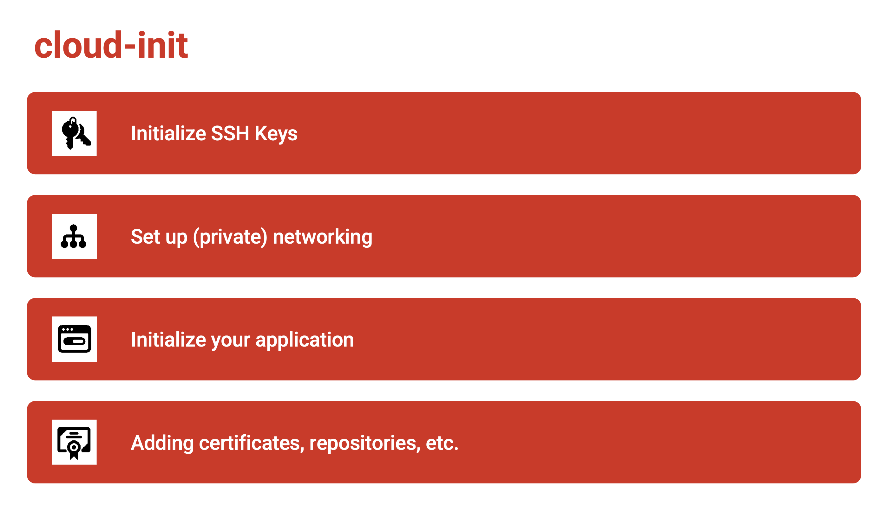

Explained

Cloud-Init is the industry-standard method for cross-platform cloud instance initialization and supports all major public cloud providers and provisioning systems for cloud infrastructure installations. During boot, Cloud-Init identifies the cloud it runs on and initializes the system accordingly. Cloud instances will automatically be provisioned during the first boot with networking, storage, SSH keys, packages, and other system aspects already configured. Cloud-Init provides the necessary glue between launching a cloud instance and connecting to it so that it works as expected.

### User Data
The User Data field can be used for configurations after the cloud instance has been booted. You can use either distribution-specific scripting languages (bash, PowerShell, etc.) or the distribution-independent method of cloud-config. For example, you want to install the web server nginx automated after the cloud instance finishes booting.

### Simple Example - distribution-specific
```#!/bin/bash
sudo apt-get update
sudo apt-get upgrade –y
sudo apt-get install –y nginx
sudo systemctl start nginx
```

This example is specific for a Linux distribution.

### Simple Example - distribution-independent

```
#cloud-config
package_upgrade: true
packages: 
   - nginx
runcmd:
   - systemctl start nginx
```

This example is independent and works cross-platforms.

### Complex Example

- Install and configure Web Server
- Download our application from an SOS bucket using a presigned key
- Install the application
- Run the application

```
#cloud-config
package_upgrade: true
packages:
  - nginx
  - nodejs
  - npm
write_files:
  - owner: www-data:www-data
    path: /etc/nginx/sites-available/default
    content: |
      server {
        listen 80;
        location / {
          proxy_pass http://localhost:3000;
          proxy_http_version 1.1;
          proxy_set_header Upgrade $http_upgrade;
          proxy_set_header Connection keep-alive;
          proxy_set_header Host $host;
          proxy_cache_bypass $http_upgrade;
        }
      }
runcmd:
  - systemctl restart nginx
  - cd "/home/webapp/myapp"
  - [ wget, "https://sos-de-muc-1.exo.io/demo-webinar/application.zip?X-Amz-Algorithm=AWS4-HMAC-SHA256&X-Amz-Credential=....", -O, /home/webapp/myapp/app.zip ]
  - unzip app.zip
  - npm init
  - nodejs index.js
```

### Overview

cloud-init



### LINK Cloud-Init Documentation


[cloudinit.readthedocs.io](https://cloudinit.readthedocs.io/en/latest/#)
