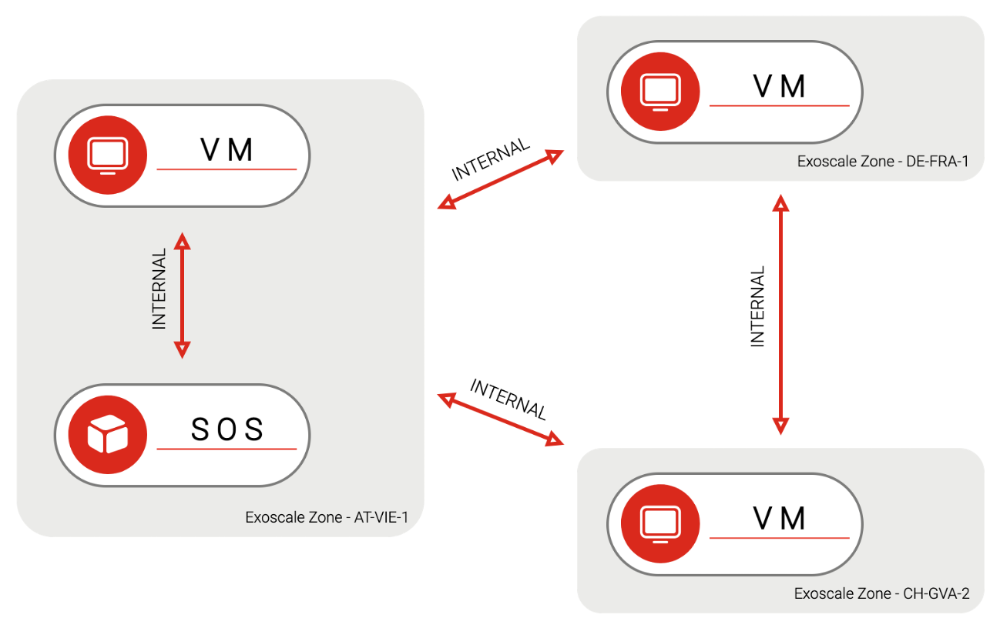
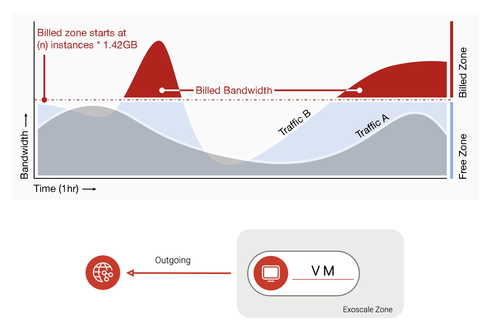

Overview

Data exchange between computers is called traffic, and in cloud computing, this is an important topic at least from two angles:

- performance
  - throughput
  - latency
- cost
  - data volume
  - timeframe

So let’s look into it.

### Internal Traffic

Definition Internal:

- Between all Exoscale Services inside a zone
- Between all Exoscale Services beyond zone borders

Internal traffic is free!

### Incoming Traffic
Traffic coming from the internet is free.

### Outgoing Traffic
Traffic towards the Internet is billed. BUT, it comes with a free tier at Exoscale:

- 1.42 GB per instance in the period of one hour
- Free traffic is shared in the organization
- Free traffic is only available in the hour created

### Example
Two examples to illustrate the free tier and the billing aspects:

- Instance A and B
   - A creates 2 GB of outgoing traffic
   - B creates 0.5 GB of outgoing traffic
   - Completely under free tier, as both together have 2.84 of free traffic
- Instance A exist inside one hour
   - A creates 2 GB of outgoing traffic
   - 1.42 GB are free, 580 MB are to be paid

