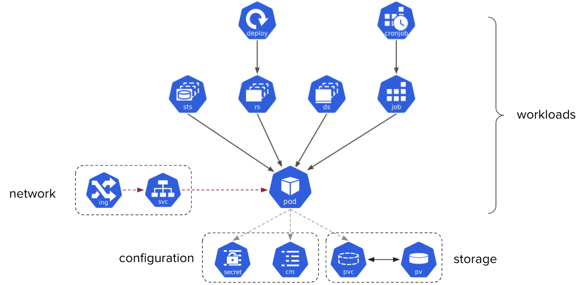
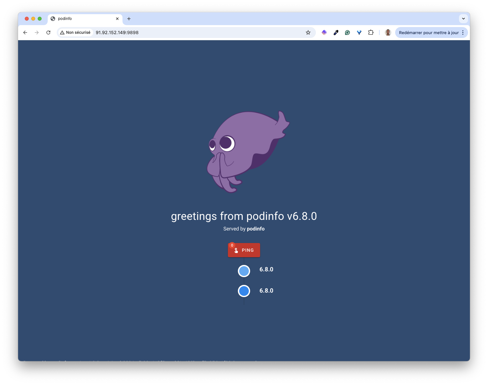
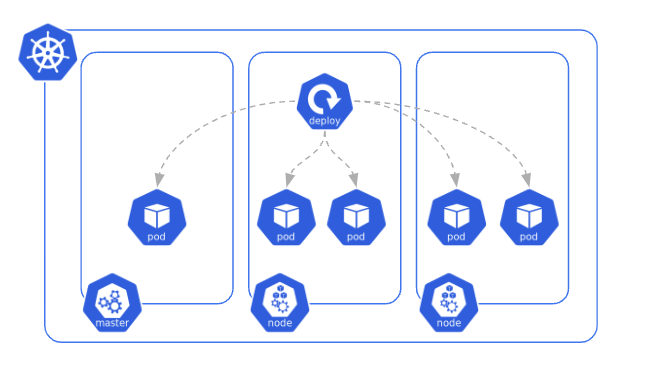
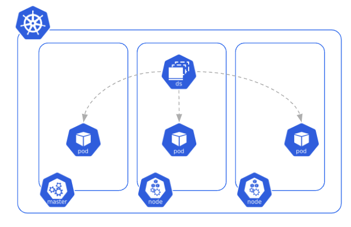
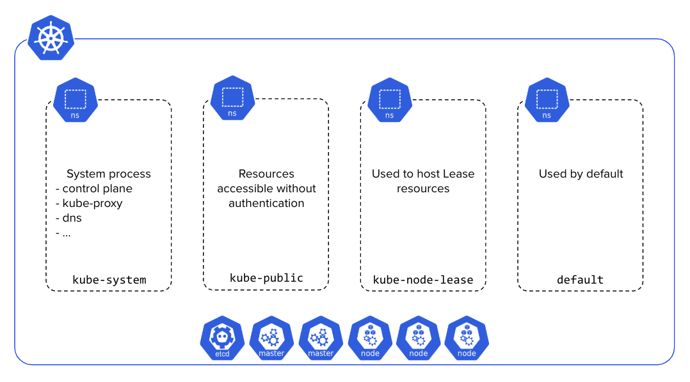
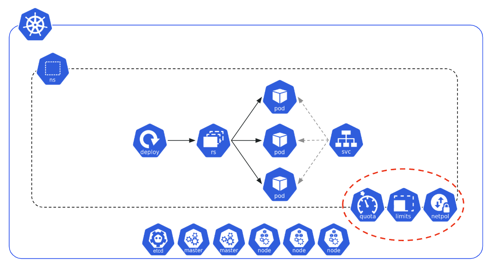

Create and manage Pods, Deployments, and other workload resources.

This section is a refresher that provides an overview of the primary Kubernetes resources related to workloads. At the end of this section, please complete the exercises to put these concepts into practice.



## Pod
---

### Purpose

A Pod is the smallest workload unit in Kubernetes. It's an abstraction containing one or more containers in charge of running applications.

### Sample specification

Below is the simplest version of a Pod, this one runs a container based on the **stefanprodan/podinfo** image.

```yaml
apiVersion: v1
kind: Pod
metadata:
  name: podinfo
spec:
  containers:
  - name: podinfo
    image: stefanprodan/podinfo
```

We create the Pod with the usual kubectl command from this YAML definition.

```bash
kubectl apply -f pod.yaml
```

As a Pod does not expose the application it is running (this is the role of the Service resource, which we'll detail later in this workshop), we can access the application using a port-forward command as follows.

```bash
kubectl port-forward podinfo 9898:9898 --address 0.0.0.0
```

This command opens port 9898 on the machine it is run from and forwards traffic to port 9898 in the Pod. The `–address 0.0.0.0` flag ensures this port is available on all the network interfaces of the host machine (otherwise limited to localhost).



### Enhanced specification

The simple specification we saw above is too simple and must not be run in a production environment. Below is a more complete specification, including additional properties:

- **resources**, which specifies the requirements and limits in terms of CPU and RAM
- **livenessProbe**, which ensures the application is healthy
- **readinessProbe**, which ensures the application is ready to accept requests
- **securityContext**, which adds security constraints

```yaml
apiVersion: v1
kind: Pod
metadata:
  name: podinfo
  labels:
    app: podinfo
spec:
  containers:
  - image: stefanprodan/podinfo:6.1.0
    name: podinfo
    resources:
      requests:
        cpu: 50m
        memory: 64Mi
      limits:
        cpu: 50m
        memory: 64Mi
    livenessProbe:
      httpGet:
        path: /healthz
        port: 9898
      initialDelaySeconds: 3
      periodSeconds: 3
    readinessProbe:
      httpGet:
        path: /readyz
        port: 9898
      initialDelaySeconds: 3
      periodSeconds: 3
    securityContext:
      allowPrivilegeEscalation: false
      readOnlyRootFilesystem: true
      runAsUser: 10000
      runAsNonRoot: true
      seccompProfile:
        type: RuntimeDefault
      capabilities:
        drop:
        - ALL
```

## Deployment
---



### Purpose

A Deployment runs a given number of identical Pods across the cluster. The number of replicas can easily be scaled (manually or with an HPA).

### Sample specification

The following specification defines a Deployment in charge of 5 Pods based on the **nginx:1.24** image.

```yaml
apiVersion: apps/v1
kind: Deployment
metadata:
  name: www
spec:
  replicas: 5
  selector:
    matchLabels:
      app: www
  template:
    metadata:
      labels:
        app: www
    spec:
      containers:
      - name: www
        image: nginx:1.24
        ports:
        - containerPort: 80
```

## DaemonSet
---



### Purpose

A DaemonSet ensures a Pod (usually an agent) is running on each cluster's Node.

### Sample specification

The following specification defines a DaemonSet in charge of running a fluentbit Pod on each node of the cluster.

```yaml
apiVersion: apps/v1
kind: DaemonSet
metadata:
  name: fluent-bit
spec:
  selector:
    matchLabels:
      k8s-app: fluent-bit-logging
  template:
    metadata:
      labels:
        k8s-app: fluent-bit-logging
    spec:
      containers:
      - name: fluent-bit
        image: fluent/fluent-bit:1.5
        volumeMounts:
        - name: varlog
          mountPath: /var/log
        - name: varlogcontainers
          mountPath: /var/log/containers
      volumes:
      - name: varlog
        hostPath:
          path: /var/log
      - name: varlogcontainers
        hostPath:
          path: /var/log/containers
```

## Job
---

### Purpose

A Job allows running several Pods in parallel or sequence. This must not be used to run long-running tasks, like application servers.

### Sample specification

The following specification defines a Job running 3 Pods in parallel to train a machine learning model.

```yaml
apiVersion: batch/v1
kind: Job
metadata:
  name: training
spec:
  completions: 3
  parallelism: 3
  template:
    spec:
      restartPolicy: OnFailure
      containers:
      - name: training
        image: org/ml-training:1.2
```

## CronJob
---

### Purpose

A CronJob is in charge of launching Jobs according to a schedule, similar to the Linux crontab.

### Sample specification

The following specification defines a CronJob in charge of running a backup Job every 6 hours.

```yaml
apiVersion: batch/v1
kind: CronJob
metadata:
  name: dump
spec:
  schedule: "0 */6 * * *"
  jobTemplate:
    spec:
      template:
        spec:
          restartPolicy: OnFailure
          containers:
          - name: dump
            image: org/db-dump:2.3
```

## ConfigMap
---

### Purpose

A ConfigMap is not used to run Pods, unlike the resources above. Instead, we use it to configure the application running in Pods. A ConfigMap contains files or key/value pairs that we provide to the containers either:

- via environment variables
- or mounted as a volume

### Sample specification

The following specification defines a ConfigMap containing a nginx configuration file.

```yaml
apiVersion: v1
kind: ConfigMap
metadata:
  name: proxy-config
data:
  nginx.conf: |
    user nginx;
    worker_processes 4;
    pid /run/nginx.pid;
    events {
      worker_connections 768;
    }
    http {
      server {
        listen *:80;
        location = /whoami {
          proxy_pass http://whoami/;
        }
      }
    }
```

### Usage in a Pod

The following specification illustrates how to use this ConfigMap in a Pod. The **nginx.conf** file is made available in the `/etc/nginx/config.conf` in the Pod's container.

```yaml
apiVersion: v1
kind: Pod
metadata:
  name: www
spec:
  containers:
  - name: proxy
    image: nginx:1.24
    volumeMounts:
    - name: config
      mountPath: "/etc/nginx/"
  volumes:
  - name: config
    configMap:
      name: nginx-config
```

## Secret
---

### Purpose

A Secret is very similar to a ConfigMap except that it is used to handle sensitive information (credentials, ssh keys) as it can be encrypted. As for ConfigMap, a Secret contains files or key/value pairs that we can provide to the containers either:

- via environment variables
- or mounted as a volume

When viewing a Secret's specification, we can see base64 encoded (not encrypted) content.

### Sample specification

The following specification defines a Secret containing an encoded MongoDB connection string.

```yaml
apiVersion: v1
kind: Secret
metadata:
  name: mongo-credentials
data:
  mongo_url: dG9rZW49Y2IzNDU2YTU0RUI1Cg==
type: Opaque
```

### Usage in a Pod

The specification below illustrates how to use a Secret in a Pod. The Secret's unique key is available as an environment variable in the Pod's container.

```yaml
apiVersion: v1
kind: Pod
metadata:
  name: api
spec:
  containers:
  - name: api
    image: api:1.2
    env:
    - name: MONGO_URL
      valueFrom:
        secretKeyRef:
          name: mongo-credentials
          key: mongo_url
```

## Namespaces
---

Namespaces are Kubernetes resources that allow grouping resources. The image below illustrates the Namespaces created by default.



As Namespaces do not offer strong isolation, specific resources must be applied to a Namespace to limit CPU, RAM usage, and network rules allowed within and across Namespaces. Those resources are:

- **ResourceQuota**
- **Limits**
- **NetworkPolicy**

