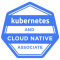
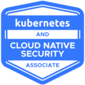
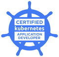
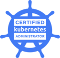
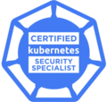
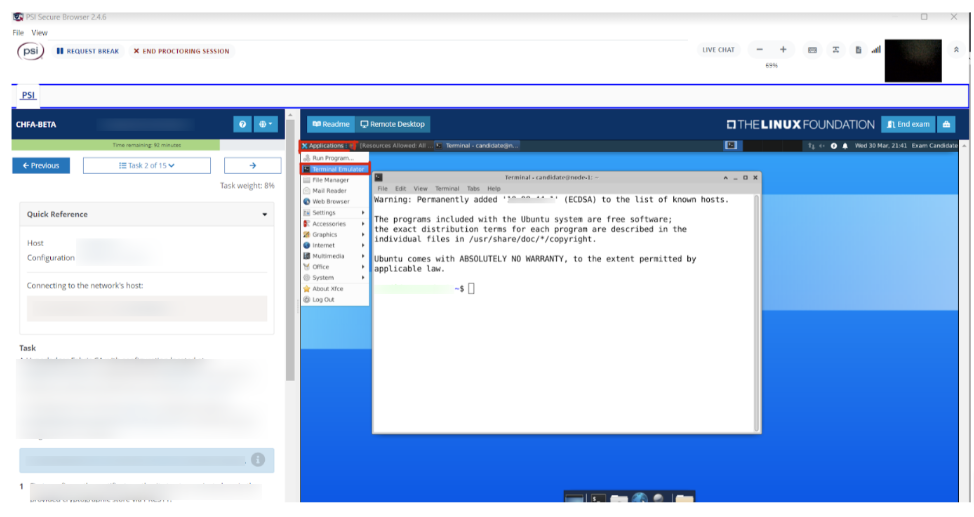

Get an overview of the existing Kubernetes certifications and what you need to learn for the CKA.

## Several certifications available
---

| Certification                                         | Type     | Badge |
|-------------------------------------------------------|----------|-------|
| Kubernetes and Cloud Native Associate (KCNA)          | MCQ      |  |
| Kubernetes and Cloud Native Security Associate (KCSA) | MCQ      |  |
| Certified Kubernetes Application Developer (CKAD)     | Practice |  |
| Certified Kubernetes Administrator (CKA)              | Practice |  |
| Certified Kubernetes Security Specialist (CKS)        | Practice |  |

\* *passing the CKA is a requirement before passing the CKS*

If you pass all those certifications, you become a [Kubestronaut](https://www.cncf.io/training/kubestronaut/).

## Expectation for the CKA
---

The following table summarizes the distribution of the CKA questions across 5 main subjects.

| Subject                                            |  %  |
|----------------------------------------------------|-----|
| Cluster Architecture, Installation & Configuration | 25% |
| Workloads & Scheduling                             | 15% |
| Services & Networking                              | 20% |
| Storage                                            | 10% |
| Troubleshooting                                    | 30% |

## CKA Environment
---

The CKA is a 2h exam. It contains 15/20 questions and requires at least 66% correct answers. This exam is remotely proctored, so you can take it from home (or any other quiet location) at a time that best suits your schedule.

Before launching the exam, which you do via your [Linux Foundation Training Portal](https://trainingportal.linuxfoundation.org/access/saml/login), you need to perform a couple of prerequisites including making sure the PSI Browser works correctly on your environment. This browser gives you access to the remote Desktop you'll use during the exam.



## Tips & tricks
---

### Tools

Make sure you have a basic knowledge of

- **vim**
- **openssl**

```bash
# Visualize the content of a certificate
openssl x509 -in cert.crt -noout -text
```

- **systemd / systemctl / journalctl**

```bash
# Restart kubelet
systemctl restart kubelet

# Check kubelet logs
journalctl -u kubelet
```

### Aliases

Defining a couple of aliases at the very beginning of the examination could save time.

```bash
alias k=kubectl
export dr="--dry-run=client -o yaml"
export fd="--grace-period=0 --force"
```

### Imperative commands

Don't create specifications manually, instead use `--dry-run=client -o yaml` as in these examples.

```bash
k run nginx --image=nginx:1.20 --dry-run=client -o yaml > pod.yaml
k create deploy www --image=nginx:1.20 --replicas=3 --dry-run=client -o yaml > deploy.yaml
k create role create-pod --verb=create --resource=pods --dry-run=client -o yaml > role.yaml
```

Quickly change the current Namespace.

```bash
k config set-context --current --namespace=dev
```

Don't wait for the grace period to get rid of a Pod.

```bash
k delete po nginx --force --grace-period=0
```

### Reference guide

The [Kubectl quick reference guide](https://kubernetes.io/docs/reference/kubectl/quick-reference/) is a must-read.

### Access to exam simulator

Registering for the CKA gives you access to two sessions of the official Exam simulator. I highly recommend using these sessions once you're almost ready.