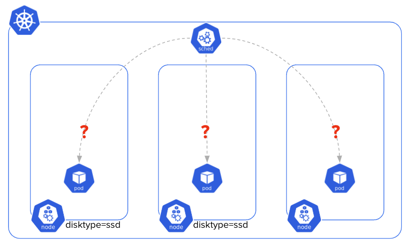
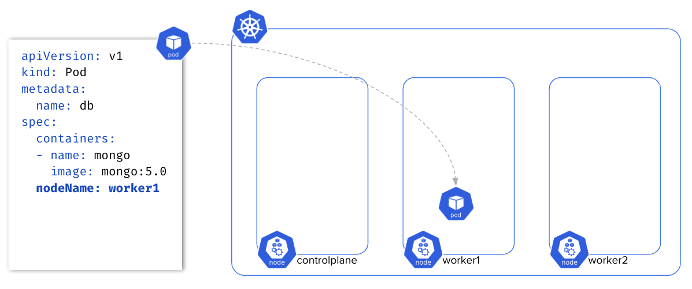
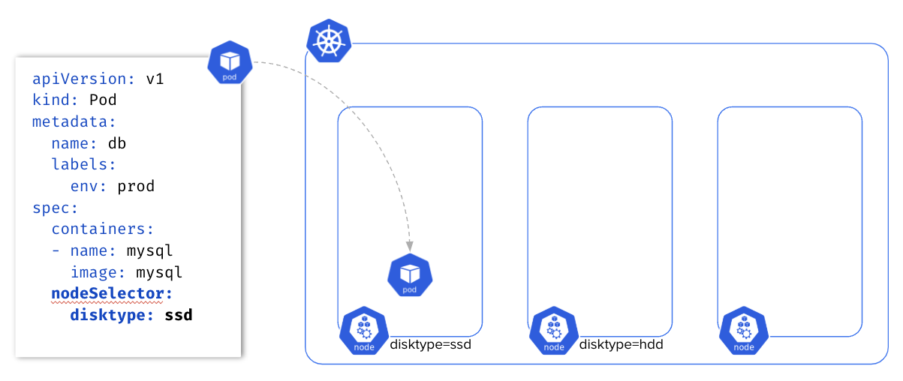
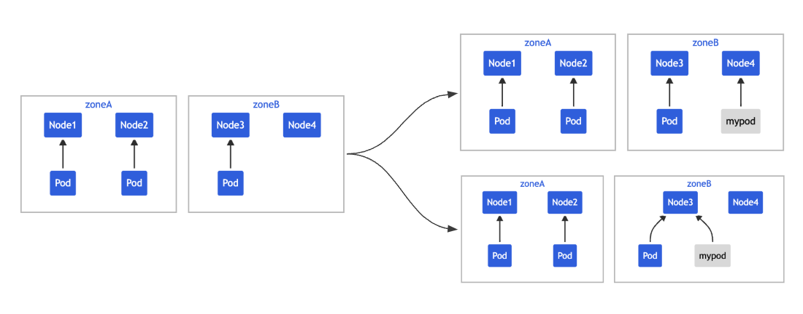

This section is a refresher that provides an overview of the main properties involved in the scheduling phase. At the end of this section, please complete the exercises to apply these concepts.

## Purpose
---

The scheduling step is where Kubernetes decides on which Node a Pod will run on. The Scheduler, running on the control plane, is the process in charge of this action.



There are various properties/items which can influence the scheduling decision, including:

- `nodeName`
- `nodeSelector`
- `nodeAffinity`
- `podAffinity / podAntiAffinity`
- `topologySpreadConstraints`
- `taint / toleration`
- `available resources`
- `priorityClass`
- `runtimeClass`

## nodeName
---

The `nodeName` property bypasses the scheduling process, indicating directly in the Pod's specification the name of the Node this Pod must be deployed to.



## nodeSelector
---

The `nodeSelector` property uses Node's labels to schedule a Pod.



## nodeAffinity
---

The `nodeAffinity` property also uses Node's label. Still, it is more granular than `nodeSelector` as it can use the following operators on the labels: **In**, **NotIn**, **Exists**, **DoesNotExist**, **Gt**, and **Lt**.

Two rules are available when using `nodeAffinity`:

- `requiredDuringSchedulingIgnoredDuringExecution` defines a **hard constraint**: if the scheduler does not manage to schedule the Pod according to the specification, then the Pod will remain in Pending
- `preferredDuringSchedulingIgnoredDuringExecution` defines a **soft constraint**: if the scheduler does not manage to schedule the Pod, according to the specification, then it will do its best to schedule it anyway, even if the requirements are not satisfied

### Example:

```yaml
spec:
  affinity:
    nodeAffinity:
      requiredDuringSchedulingIgnoredDuringExecution:
        nodeSelectorTerms:
        - matchExpressions:
          - key: kubernetes.io/e2e-az-name Pod must be scheduled on a node having the label
            operator: In kubernetes.io/e2e-az-name with the value e2e-az1 or e2e-az2
            values:
            - e2e-az1
            - e2e-az2
      preferredDuringSchedulingIgnoredDuringExecution:
      - weight: 1
        preference:
          matchExpressions: Pod preferably scheduled on a node having the label
          - key: disktype disktype with the value ssd
            operator: In
            values:
            - ssd
```

## podAffinity / podAntiAffinity
---

We use the `podAffinity` and `podAntiAffinity` properties to schedule a Pod based on the labels of already existing Pods.

It uses the same rules as the `nodeAffinity` property:
- `requiredDuringSchedulingIgnoredDuringExecution` defines a **hard constraint**
- `preferredDuringSchedulingIgnoredDuringExecution` defines a **soft constraint**

It also uses a property named `topologyKey` to specify geographical preferences (among other things):
- `hostname`
- `region`
- `az`
- ...

### Example 1

The following Deployment's Pods cannot all be created on a cluster with less than 4 Nodes as it specifies that two Pods with the `app: cache` label must not be on the same Node.

```yaml
apiVersion: apps/v1
kind: Deployment
metadata:
  name: cache
spec:
  replicas: 4
  selector:
    matchLabels:
      app: cache
  template:
    metadata:
      labels:
        app: cache
    spec:
      containers:
      - name: redis
        image: redis:6
      affinity:
        podAntiAffinity:
          requiredDuringSchedulingIgnoredDuringExecution:
          - labelSelector:
              matchExpressions:
              - key: app
                operator: In
                values:
                - cache
            topologyKey: "kubernetes.io/hostname"
```

### Example 2

The following specification illustrates the usage of both `podAffinity` and `podAntiAffinity` properties.

```yaml
spec:
  affinity:
    podAffinity:
      requiredDuringSchedulingIgnoredDuringExecution: Pod must be scheduled on a node which is in the availability
      - labelSelector: zone where already exists a Pod with the label security: S1
          matchExpressions:
          - key: security
            operator: In
            values:
            - S1
        topologyKey: failure-domain.beta.kubernetes.io/zone
    podAntiAffinity:
      preferredDuringSchedulingIgnoredDuringExecution: Pod should not be scheduled on a node where already exists
      - podAffinityTerm: a Pod with the label security: S2
          labelSelector:
            matchExpressions:
            - key: security
              operator: In
              values:
              - S2
          topologyKey: kubernetes.io/hostname
```

## TopologySpreadConstraints
---

The `topologySpreadConstraints` property defines how to spread Pods across a cluster topology, ensuring application resiliency.

The following Deployment uses the `topologySpreadConstraints` property to ensure Pods are correctly balanced between AZ and Node.



```yaml
apiVersion: apps/v1
kind: Deployment
metadata:
  name: www
spec:
  replicas: 4
  selector:
    matchLabels:
      app: www
  template:
    metadata:
      labels:
        app: www
    spec:
      containers:
      - name: nginx
        image: nginx:1.24
      topologySpreadConstraints:
      - maxSkew: 1 The difference in the number of matching Pods between
        topologyKey: "kubernetes.io/hostname" any two nodes should be no more than 1 (maxSkew)
        whenUnsatisfiable: ScheduleAnyway
        labelSelector:
          matchLabels:
            app: www
      - maxSkew: 1 Ensures that the Pods are spread across different
        topologyKey: "topology.kubernetes.io/zone" availability zones
        whenUnsatisfiable: ScheduleAnyway
        labelSelector:
          matchLabels:
            app: www
```

## Taints & Tolerations
---

In contrast to the properties we saw earlier, we use a **Taint** to prevent certain Pods from being scheduled on a node. A Pod must tolerate a Taint, using a `toleration` property, to be scheduled on a Node having that Taint.

A Taint has 3 properties:
- `key`: it can be arbitrary string content, same format as labels
- `value`: it can be an arbitrary string content, same format as labels
- `effect`: among `NoSchedule`, `PreferNoSchedule` and `NoExecute`

By default, a kubeadm cluster sets a Taint on the control plane Nodes. This Taint prevents a Pod from being deployed on these Nodes unless the Pod explicitly tolerates this Taint.

The following command lists the Taints existing on the controlplane Node.

```bash
$ kubectl get no controlplane -o jsonpath='{.spec.taints}' | jq
[
  {
    "effect": "NoSchedule",
    "key": "node-role.kubernetes.io/control-plane"
  }
]
```

When creating the following Deployment, with 10 replicas of nginx Pods, none of the Pods will land on the controlplane because of this specific Taint.

```yaml
apiVersion: apps/v1
kind: Deployment
metadata:
  name: www
spec:
  replicas: 10
  selector:
    matchLabels:
      app: www
  template:
    metadata:
      labels:
        app: www
    spec:
      containers:
      - image: nginx:1.24
        name: nginx
```

We must add a toleration for the Taint, so the scheduler can schedule Pods on the controlplane.

```yaml
apiVersion: apps/v1
kind: Deployment
metadata:
  name: www
spec:
  replicas: 10
  selector:
    matchLabels:
      app: www
  template:
    metadata:
      labels:
        app: www
    spec:
      tolerations:
      - key: node-role.kubernetes.io/control-plane
        effect: NoSchedule
      containers:
      - image: nginx:1.24
        name: nginx
```

## PriorityClass
---

A `PriorityClass` is a Kubernetes resource that defines the priority of Pods. It influences scheduling decisions and preemption - meaning that higher-priority Pods can evict lower-priority ones if resources are scarce. A PriorityClass can be preempting (default behavior) or non-preempting, depending on the `preemtionPolicy` property.

The following specifications define a high-priority PriorityClass and a Pod using it.

```yaml
apiVersion: scheduling.k8s.io/v1
kind: PriorityClass
metadata:
  name: high-priority
value: 1000000
globalDefault: false
---
apiVersion: v1
kind: Pod
metadata:
  name: nginx
spec:
  containers:
  - name: nginx
    image: nginx
  priorityClassName: high-priority
```

## RuntimeClass
---

A `RuntimeClass` allows to have multiple container runtimes in the cluster, and to select the one which best fits a workload. There are several container runtimes, each one of them addresses specific use cases, including:

- [Containerd](https://containerd.io/) is a general-purpose container runtime (CNCF Graduated)
- [CRI-O](https://github.com/cri-o/cri-o) is a light container runtime focusing on Kubernetes (CNCF Graduated)
- [GVisor](https://gvisor.dev/) is used to run an unsecure workload in a sandbox
- [Kata-Container](https://katacontainers.io/) uses Micro VMs for workload isolation
- [Firecracker](https://firecracker-microvm.github.io/) uses Micro VMs, mainly for serverless
- [WasmEdge](https://wasmedge.org/) is dedicated to run Wasm workload

In a Pod specification, we can specify the container runtime configuration needed by this workload. The scheduler ensures that Pods are placed on Nodes that support the required container runtime configuration.

Let's say our cluster already has a RuntimeClass named `gvisor`, then we can use it in the Pod specification as follows.

```yaml
apiVersion: v1
kind: Pod
metadata:
  name: nginx
spec:
  containers:
  - name: nginx
    image: nginx
  runtimeClass: gvisor
```