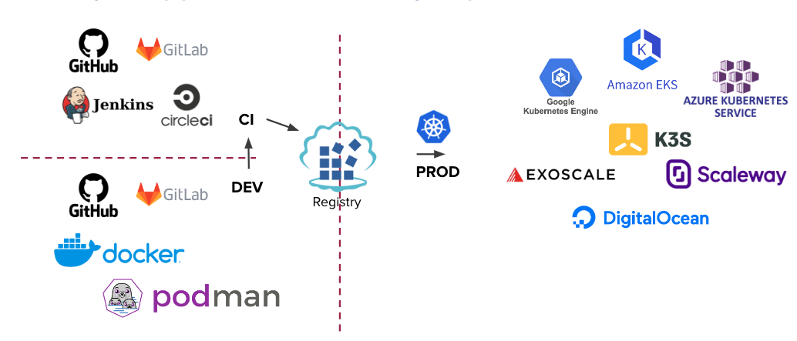
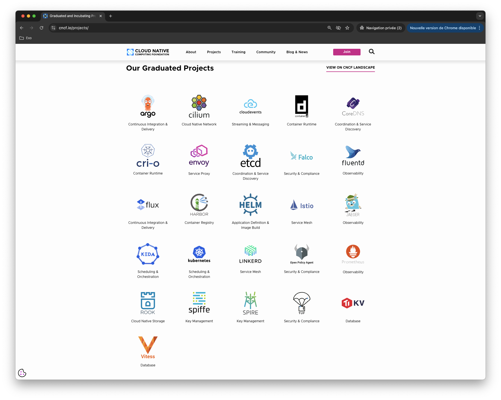
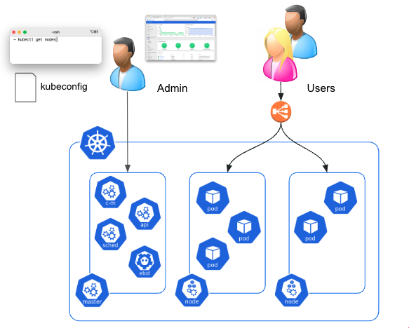
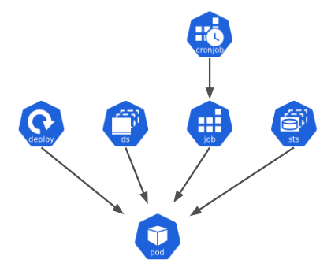
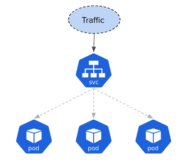
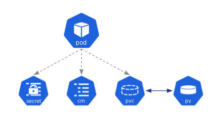
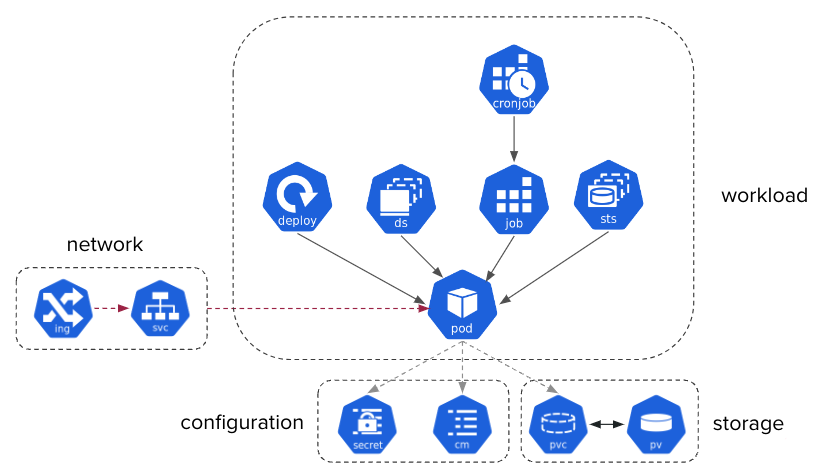
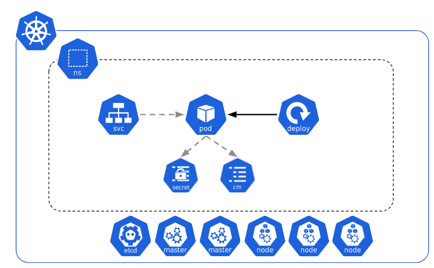

## History

Kubernetes also called *k8s* (a "k" followed by 8 chars and a "s") or simply *kube* means "Helmsman" in Greek. It is a container orchestrator inspired by Google Borg System which were orchestrating billions of containers on Google infrastructure.  

Version *v1.0.0* of Kubernetes was released in July 2015, the last version as of today (October 2024) is *v1.31.1*. The release cycle is quite fast with 3 minor releases per year.

## Main functionalities

Kubernetes is a container orchestrator offering main functionalities, such as:

- Management of applications running in containers
- Self-healing
- Service discovery
- Usage of Secrets and Configurations
- Long-running process and batch jobs
- Role Based Access Control (RBAC)
- Storage Orchestration

## Manages applications in production


## Major project in the open-source ecosystem

Kubernetes is the first graduated project within the [CNCF](https://cncf.io/projects), it was followed by major players like [etcd](https://etcd.io) and [Prometheus](https://prometheus.io/) 


## What is a Kubernetes cluster made of ?

A Kubernetes cluster is composed of nodes, where a node is either a virtual machine or a bare metal server. A node can belong to the Control Plane which run processes in charge of managing the cluster and the applications running on it. Or, a node can be a Worker dedicated to run Pods, a group of containers sharing a network stack and storage.


## How to access a cluster

A cluster usually comes with a kubeconfig file which contains all the information to communicate with the cluster API Server. This file can be used to configure the standard *kubectl* binary to manage the cluster. The kubeconfig file can also be used with tools like [k9s](https://k9scli.io/), [Mirantis Lens](https://k8slens.dev/), ... which give a higher level view of the cluster.



## Various workload resources for different use cases

To run a Pod we often rely on a higher level resource, instead of running it directly. The workload resources are:

- Deployment : web server
- DaemonSet : one agent per node
- Job / CronJob : batch
- StatefulSet : stateful application

<!--  -->


A request that reaches a Service is load-balanced between the exposed Pods

<!--  -->



A Pod can use several resources

- ConfigMap : contains configuration data
- Secret : contains sensitive data
- PersistentVolumeClaim / PersistentVolume : storage management




## Several types of resources



## An application runs in a Namespace




## Resource creation

Each resource is defined in a YAML specification which is sent to the API Server using the kubectl binary.

```yaml
apiVersion: v1
kind: Pod
metadata:
  name: www
spec:
  containers:
  - name: www
    image: nginx:1.24
```

```bash
kubectl apply -f www.yaml
```
