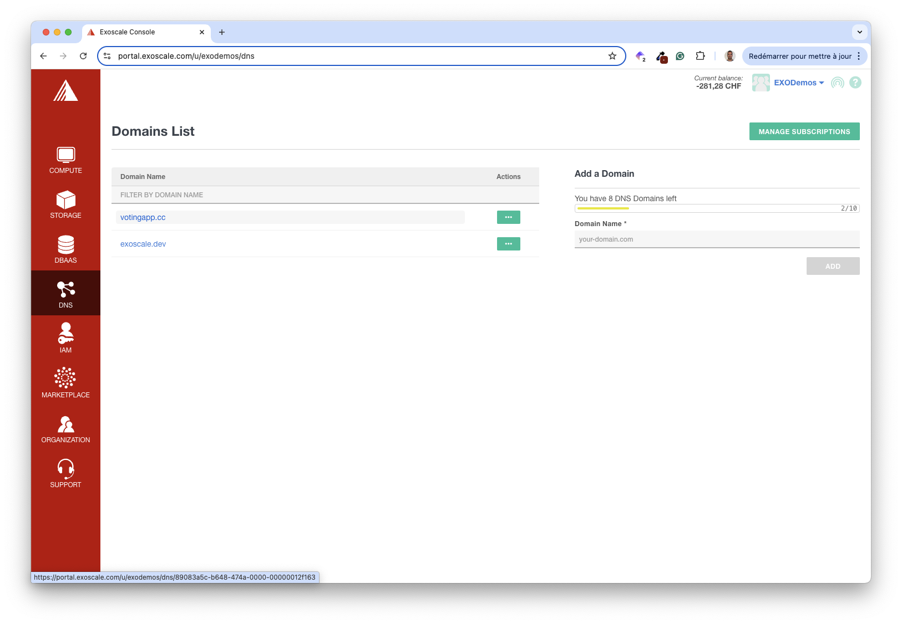
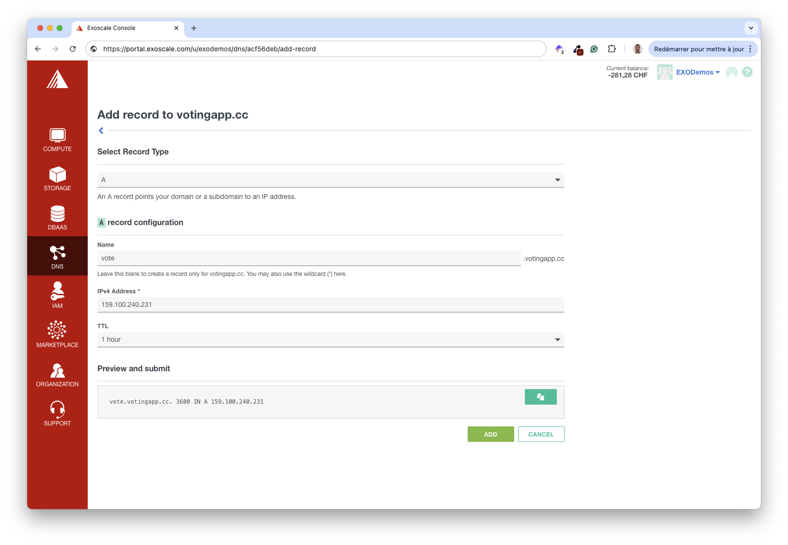
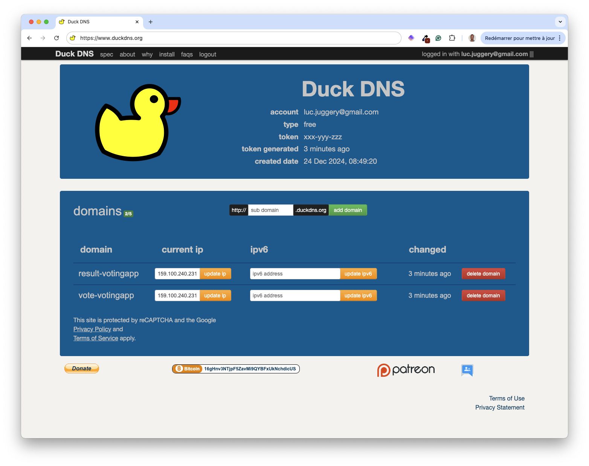
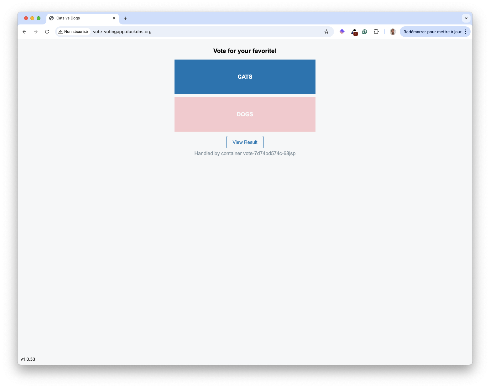
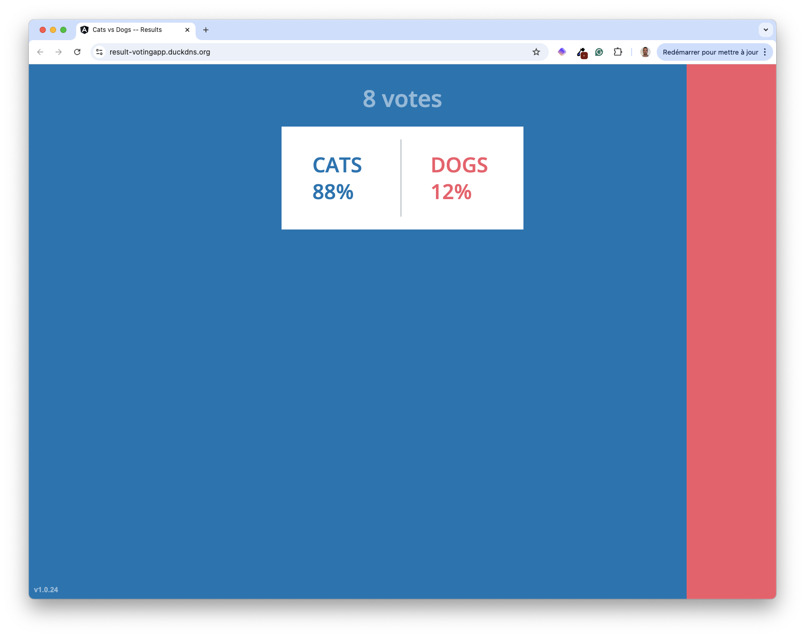

In this section, you’ll expose the VotingApp on a real domain name. We’ll consider several possibilities:

- you have a domain name managed by Exoscale DNS
- you have a domain name managed by another DNS provider
- you don’t have any domain name to use for this workshop

> [!NOTE]
> If you want to use Exoscale DNS service to manage your domain, please follow the steps defined in the [Exoscale Community](https://community.exoscale.com/product/dns/quick-start/).

## Upgrade the application

First, change the content of the *values.yaml* file to ensure the application is exposed on your own domains/subdomains (replace DOMAIN.TLD with your own domain)

```yaml {filename="values.yaml"}
ingress:
  enabled: true
  hosts:
    vote: vote.DOMAIN.TLD
    result: result.DOMAIN.TDD
```

Next, upgrade the application:

```bash
helm upgrade --install vote oci://registry-1.docker.io/voting/app --version v1.0.36 --namespace vote --create-namespace -f values.yaml
```

The application is now exposed on http://vote.DOMAIN.TLD and https://result.DOMAIN.TLD. Before you can access the web frontends, you need to update the DNS records for both vote.DOMAIN.TLD and result.DOMAIN.TLD, so they resolve to the IP Address of the Ingress Controller.

## 1st case: you have a domain name managed by Exoscale DNS

> [!NOTE]
> In the example below, we consider the domain name votingapp.cc. Follow these steps for your own domain name.

First, navigate to the DNS section using the menu on the left, then select your domain.



Next, add an A record so the vote subdomain resolves to the IP address of your cluster’s Ingress Controller:



Next, add a similar A record for the result subdomain:


You can access the vote-ui and result-ui web interfaces on the respective subdomains.

## 2nd case: you have a domain name managed by another DNS provider

From the dashboard of your DNS, you need to create the following A records:

- vote.DOMAIN.TLD resolving to the IP Address of the Traefik Ingress Controller
- result.DOMAIN.TLD resolving to the IP Address of the Traefik Ingress Controller

Once the records are created, you can access the *vote-ui* and *result-ui* web interfaces on the respective subdomains.

## 3rd case: you don’t have any domain name to use for this workshop

From [DuckDNS](https://duckdns.org), you can create two subdomains of the *duckdns.org* domain. In this example, we’ve created the following ones:

- vote-vottingapp.duckdns.org
- result-votingapp.duckdns.org

For each of your subdomains, associate the IP address of the Traefik Ingress Controller.



Then, you can access the vote-ui web interface using the selected subdomains. The screenshot below illustrates the usage of the *vote-votingapp* and *result-votingapp* subdomains.





> [!NOTE]
> In this example, we configured DNS A records manually. To automate the process, we could use [ExternalDNS](https://kubernetes-sigs.github.io/external-dns/latest/), a tool that manages DNS records based on Ingress and Service resources.

> [!INFO]
> Want to know more about Exoscale DNS offering? Visit the [documentation](https://community.exoscale.com/product/networking/dns/) to get the entire feature set.