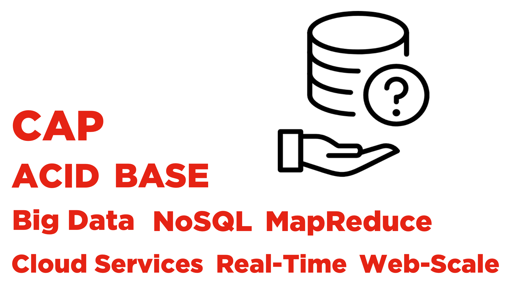
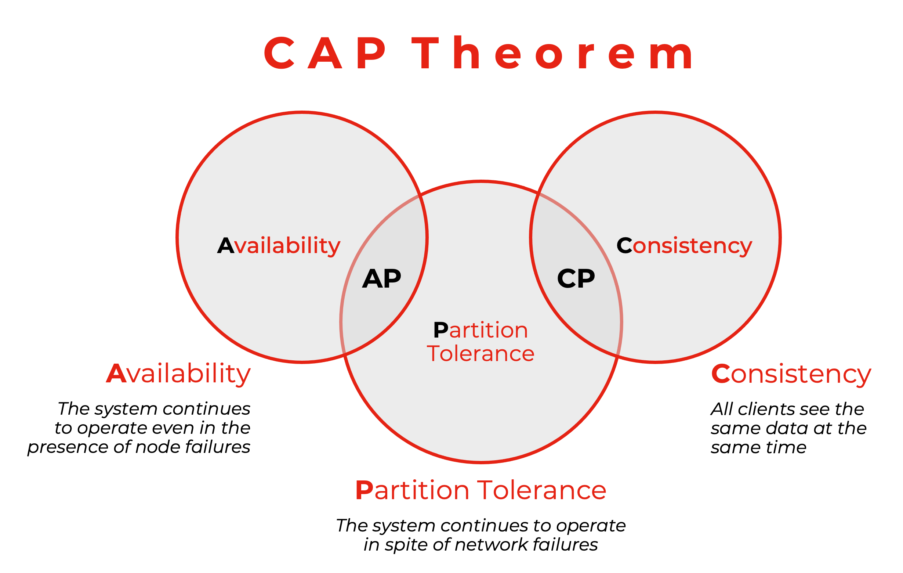
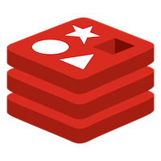
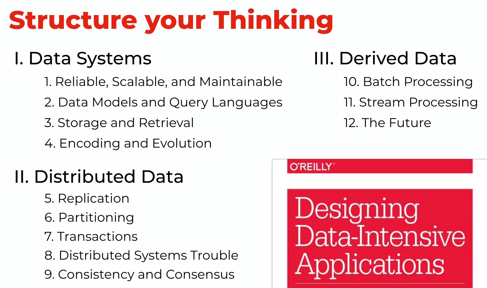

### Selection of Databases

The prolific database situation makes the pick of a particular technology not easy. Many theorems, models, and concepts support that selection process, meaning no universal solution for database choices is available.

 

The CAP theorem gives guidance and is still relevant when designing distributed applications and choosing a data store for such scenarios. Still, you have to decide if availability is the preference or consistency gets the vote.

Due to the broad spectrum of database types, a different approach for selecting the right technology for the data store is to choose based on the kind of data that needs storage. Let’s have a look at some examples:

### Managed PostgreSQL



PostgreSQL is a popular open source relational database known for its variety of features. It supports both SQL and JSON querying. The database offers a high level of integrity, correctness, and reliability. Rich features like MVCC, point in time recovery and asynchronous replication are part of the PostgreSQL database. You find more details about this database here.

### Managed MySQL



MySQL is the most widely used open source, object-relational database. It serves as a primary database for many known applications and is well known for its reliability and stability. MySQL has a very active developer community that continuously expand the MySQL functionalities. You find more details about this database here.

### Managed Apache Kafka



Apache Kafka is a distributed, open source data source optimized for real-time processing of streaming data. The database enables low latency due to decoupled data streams, which makes it extremely high performing. Apache Kafka is highly scalable thanks to its distributed nature and makes it easily scalable. You find more details about this database here.

#### Managed Redis™

Redis™ is an open source, key-value data store used as database, cache or message broker. The in-memory dataset allows for top performance, making it a good choice for caching, session management or real-time analytics. Redis™ supports atomic operations, rich data types, and Lua scripting. You find more details about this database here.

### Managed OpenSearch



OpenSearch is a community-driven, open source search and analytics suite derived from Apache 2.0 licensed Elasticsearch 7.10.2 & Kibana 7.10.2. It consists of a search engine daemon, OpenSearch, and a visualization and user interface, OpenSearch Dashboards. OpenSearch enables people to easily ingest, secure, search, aggregate, view, and analyze data. You find more details about this database here.

#### Managed OpenSearch

For example, are you dealing with structured or unstructured data, or do you have a mixed data environment?

Is one database technology sufficient to provide the functionality, or is it a blend of database technologies that deliver the solution?



Guidance is challenging to find, especially if you want to see the complete picture of available technology offers and not choosing a vendor first and then picking what is available in the portfolio.

Fortunately, a book supports in a very structured way with a map of all the relevant topics this vital selection process—this desired holistic approach to data store selection for data-intensive applications is a source of wisdom.

