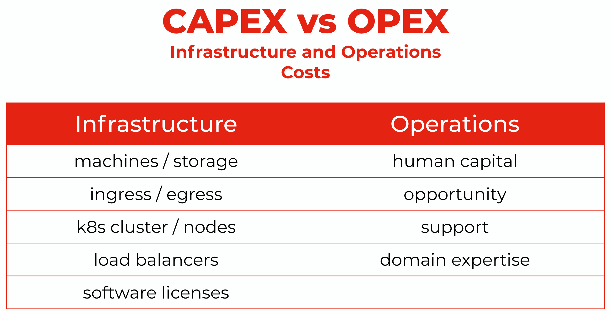

### Managed Databases

Looking at managed databases specifically, we see the benefits of simplifying the tasks associated with provisioning and maintaining a database. However, it is still likely that you need some level of experience working with databases to interact with them as you build and scale your app.

Suppose we do such evaluations in the context of IT services and factor in moving traditional data center services to the cloud. In that case, two trendy acronyms pop up immediately, CAPEX and OPEX.

Please don't put your data center glasses away too quickly. Instead, let us dig into more details about infrastructure and operations costs and look at the table below.

 

Running modern applications is a demanding business. Besides the always needed machine and storage components, more sophisticated elements like Kubernetes (k8s) clusters/nodes, load balancers, software licenses, and last but not least, required connectivity to those applications in the form of ingress and egress.

Owning all of it is a CAPEX game; taking care of it is an OPEX game, very demanding businesses, both regarding time and expertise. The time you miss following up on business opportunities is potentially lost business, valid for all who are not in the business of running data centers.