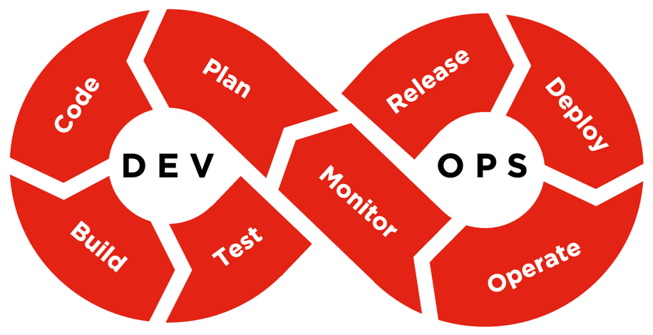
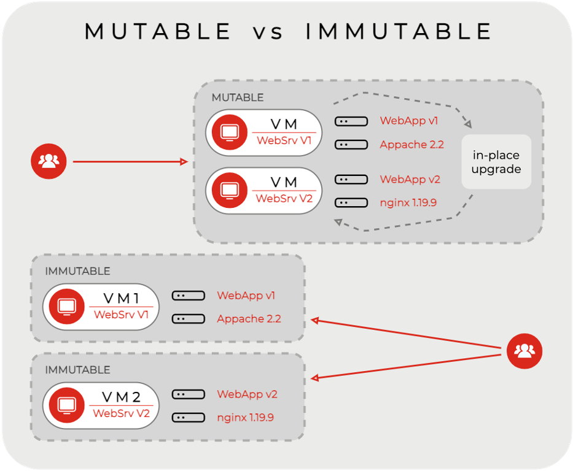

### Container Benefits

- **dev and ops separation of concerns** create application container images at build/release time rather than deployment time, thereby decoupling applications from infrastructure

- **continuous development, integration, and deployment** provides for reliable and frequent container image build and deployment with quick and efficient rollbacks – due to image immutability

- **environmental consistency across dev, test, and prod** runs the same on a laptop as it does on an on-premises server, virtualized server, and in the cloud

- **OS distribution and cloud portability** runs on Ubuntu, RHEL, CoreOS, on major public clouds, on-premises, and anywhere else

- **resource utilization and isolation benefits** higher efficiency and density due to better utilization and predictable application performance due to isolation

- **loosely coupled, distributed, elastic microservices** applications are broken into smaller, independent pieces and can be deployed and managed dynamically – not a monolithic stack running on one big single-purpose machine

- **agile application creation and deployment** increased ease and efficiency of container image creation compared to VM image use

- **application-centric management** raises abstraction level:
    - from running applications on an OS using virtual hardware
    - to running applications on an OS using logical resources