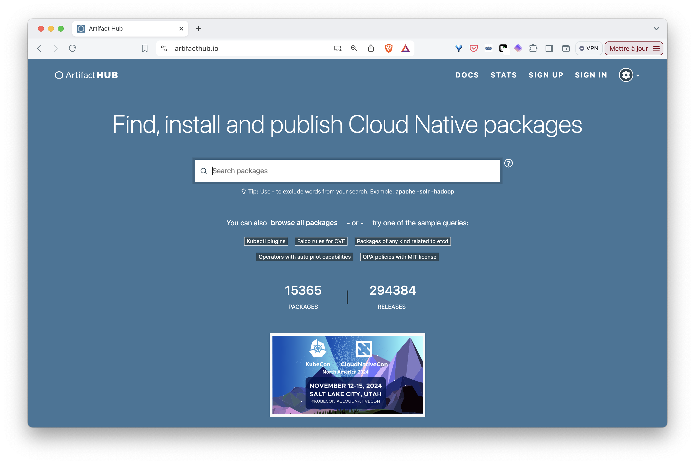
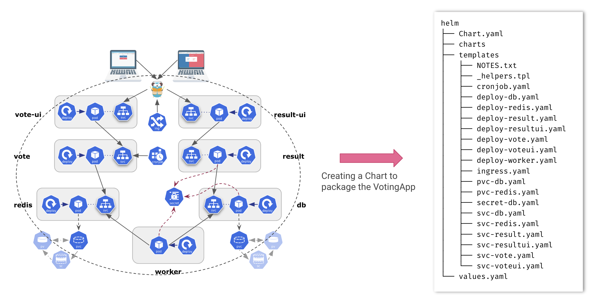

## What is Helm ?

Helm is a Package Manager for Kubernetes, it allows defining, installing, upgrading and deleting applications.  
A Helm Chart is an application packaged with Helm, it has a script file/folder structure and uses a templating language.  
The Helm Client is a binary used to manipulate application packaged with Helm.


The complete documentation can be found at [https://helm.sh](https://helm.sh)

## ArtifactHub

The [ArtifactHub](https://artifacthub.io) is the place where many applications are distributed and ready to be deployed in a Kubernetes cluster.




## Installing a chart

An application installed from a Chart is called a release.

- Installing a chart from a helm repository

```bash
# Adding a repository
helm repo add grafana https://grafana.github.io/helm-charts

# Installing a chart (= creating a release from this chart)
helm install my-grafana grafana/grafana --version 7.3.8
```

- Installing a chart from an OCI registry

```bash
helm install my-redis oci://registry-1.docker.io/bitnamicharts/redis
```

## Base commands

- Creating / upgrading a release

```bash
helm install my-release CHART_URL -f values.test.yaml
or
helm upgrade --install my-release CHART_URL -f values.test.yaml
```

- Getting information about a given release

```bash
helm get all/hooks/manifest/notes/values my-release
```

- Listing existing releases

```bash
helm list
```

- Removing a release

```bash
helm delete my-release
```

## Creating a chart to package an application

The following command creates a sample Chart containing resources to deploy a NGinx server:

```bash
helm create my-app
```

The folder structure created is as follows:

```bash
$ tree my-app
my-app
├── Chart.yaml
├── charts
├── templates
│   ├── NOTES.txt
│   ├── _helpers.tpl
│   ├── deployment.yaml
│   ├── ingress.yaml
│   ├── service.yaml
│   ├── serviceaccount.yaml
│   └── tests
│       └── test-connection.yaml
└── values.yaml
```

- Chart.yaml contains the application metadata and the dependencies list
- charts is a folder used to store the dependent charts
- NOTES.txt provides the post install instructions to the user
- _helpers.tpl contains functions and variables to simplify the templating
- the YAML files in the templates' folder contain specifications with templating code
- values.yaml defines the configuration values for the application

## Packaging the VotingApp with Helm

In the exercises we created many resources and put them all in a single folder. We will now use Helm to package the VotingApp to ease the distribution and deployment of this application.



