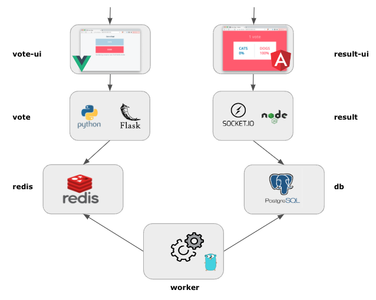

## What is a Pod ?

A Pod is the smallest unit allowing to run workload. It is a group of containers sharing a network stack and storage. The specification of a Pod is defined in an YAML file.

## Example of a simple Pod's specification:

The following specification defines a Pod which running a simple container based on the *stefanprodan/podinfo* image.

``` yaml {filename="pod.yaml"}
apiVersion: v1
kind: Pod
metadata:
  name: podinfo
spec:
  containers:
  - name: podinfo
    image: stefanprodan/podinfo
```

Many additional properties are needed for this Pod to run securely in a production environment, such as:

- resource definition to control the amount of RAM / CPU the containers can use
- readinessProbe to know when a container is ready to receive traffic
- livenessProbe to check the health of a container
- securityContext to control what the container's process can and cannot do from a security perspective 

Below is the example of a more production ready Pod's specification:

``` yaml
apiVersion: v1
kind: Pod
metadata:
  name: podinfo
  labels:
    app: podinfo
spec:
  containers:
  - image: stefanprodan/podinfo:6.1.0
    name: podinfo
    resources:
      requests:
        cpu: 50m
        memory: 64Mi
      limits:
        cpu: 50m
        memory: 64Mi
    livenessProbe:
      httpGet:
        path: /healthz
        port: 9898
      initialDelaySeconds: 3
      periodSeconds: 3
    readinessProbe:
      httpGet:
        path: /readyz
        port: 9898
      initialDelaySeconds: 3
      periodSeconds: 3
    securityContext:
      allowPrivilegeEscalation: false
      readOnlyRootFilesystem: true
      runAsUser: 10000
      runAsNonRoot: true
      seccompProfile:
        type: RuntimeDefault
      capabilities:
        drop:
        - ALL
…
```

## Base commands

- Creating a Pod using a specification

```bash
kubectl apply -f pod.yaml
```

- Creating a Pod using an imperative command

```bash
kubectl run podinfo --image=stefanprodan/podinfo
```

- Listing the existing Pods

```bash
kubectl get pods
```

- Getting a Pod’s details

```bash
kubectl get pods podinfo -o yaml
```

- Getting the main properties of a Pod

```bash
kubectl describe pod podinfo
```

- Getting the logs of a Pod’s container

```bash
kubectl logs podinfo
```

- Running an Interactive shell in a Pod’s container

```bash
kubectl exec -ti podinfo -- /bin/sh
```

- Deleting a Pod

```bash
kubectl delete pod podinfo
```

## Running the VotingApp inside Pods

As presented above, the VotingApp is a microservice application with the following architecture



You will now run a Pod for each of the microservice


