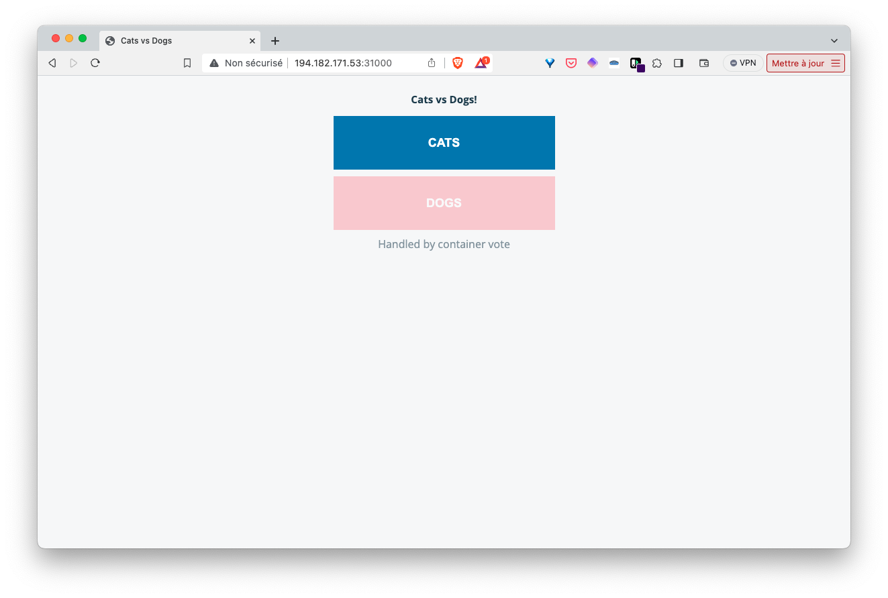
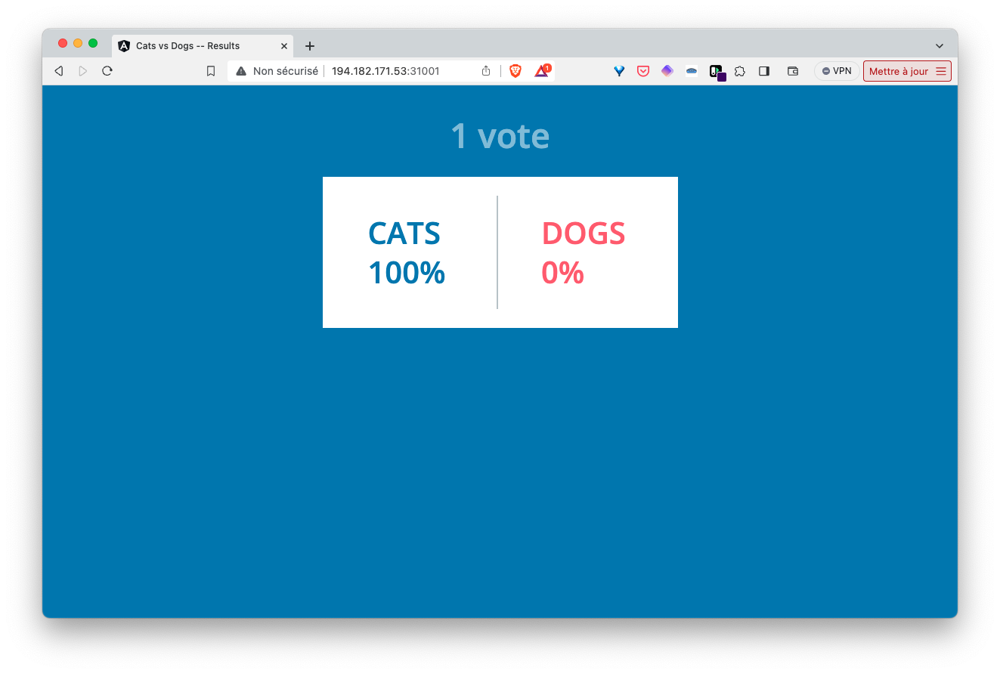

## Add Services to the VotingApp

1. In the *votingapp* directory, create YAML files containing the specifications for the Services of each microservice in the application, according to the table below:

    | Microservice | File Name         | Service Type     | Service Details                          |
    | ---          | ---               | ---              | ---                                      |
    | Vote UI      | svc-voteui.yaml   | NodePort (31000) | nodePort 31000, port: 80, targetPort: 80 |
    | Vote         | svc-vote.yaml     | ClusterIP        | port: 5000, targetPort: 5000             |
    | Redis        | svc-redis.yaml    | ClusterIP        | port: 6379, targetPort: 6379             |
    | Postgres     | svc-db.yaml       | ClusterIP        | port: 5432, targetPort: 5432             |
    | Result       | svc-result.yaml   | ClusterIP        | port: 5000, targetPort: 5000             |
    | Result UI    | svc-resultui.yaml | NodePort (31001) | nodePort 31001, port: 80, targetPort: 80 |

    Note that it is not necessary to expose the *worker* Pod with a Service as no Pod needs to connect to it. Instead, it is the *worker* Pod that connects to *redis* and *db*.

    For each Pod/Service pair, make sure to properly define a label in the Pod and the corresponding *selector* in the Service.

2. Deploy the application defined by these specifications

3. Access the vote and result interfaces via the NodePort Services

4. Delete the application

<br/>
<details>
<summary markdown="span">Solution</summary>

1. The Service specifications are as follows:


  ```yaml
  apiVersion: v1
  kind: Service
  metadata:
    labels:
      app: vote-ui
    name: vote-ui
  spec:
    type: NodePort
    ports:
      - port: 80
        targetPort: 80
        nodePort: 31000
    selector:
      app: vote-ui
  ```


  ``` yaml
  apiVersion: v1
  kind: Service
  metadata:
    labels:
      app: vote
    name: vote
  spec:
    ports:
      - port: 5000
        targetPort: 5000
    selector:
      app: vote
  ```


  ``` yaml
  apiVersion: v1
  kind: Service
  metadata:
    labels:
      app: redis
    name: redis
  spec:
    type: ClusterIP
    ports:
      - port: 6379
        targetPort: 6379
    selector:
      app: redis
  ```


  ``` yaml
  apiVersion: v1
  kind: Service
  metadata:
    labels:
      app: db
    name: db
  spec:
    type: ClusterIP
    ports:
      - port: 5432
        targetPort: 5432
    selector:
      app: db
  ```


  ``` yaml
  apiVersion: v1
  kind: Service
  metadata:
    labels:
      app: result
    name: result
  spec:
    ports:
      - port: 5000
        targetPort: 5000
    selector:
      app: result
  ```


  ``` yaml
  apiVersion: v1
  kind: Service
  metadata:
    labels:
      app: result-ui
    name: result-ui
  spec:
    type: NodePort
    ports:
      - port: 80
        targetPort: 80
        nodePort: 31001
    selector:
      app: result-ui
  ```


2. Deploy the application with the following command from the *votingapp* directory:

```bash
kubectl apply -f .
```

3. The different Pods are now in Running status:

```bash
$ kubectl get po,svc
NAME            READY   STATUS    RESTARTS   AGE
pod/db          1/1     Running   0          20s
pod/redis       1/1     Running   0          20s
pod/result      1/1     Running   0          20s
pod/result-ui   1/1     Running   0          20s
pod/vote        1/1     Running   0          20s
pod/vote-ui     1/1     Running   0          21s
pod/worker      1/1     Running   0          20s

NAME                 TYPE        CLUSTER-IP       EXTERNAL-IP   PORT(S)        AGE
service/db           ClusterIP   10.100.10.36     <none>        5432/TCP       20s
service/kubernetes   ClusterIP   10.96.0.1        <none>        443/TCP        29m
service/redis        ClusterIP   10.107.167.249   <none>        6379/TCP       20s
service/result       ClusterIP   10.105.157.142   <none>        5000/TCP       20s
service/result-ui    NodePort    10.101.30.191    <none>        80:31001/TCP   20s
service/vote         ClusterIP   10.96.108.192    <none>        5000/TCP       20s
service/vote-ui      NodePort    10.104.203.9     <none>        80:31000/TCP   20s
```

Using the IP address of one of the cluster nodes, we can access the vote and result interfaces via ports *31000* and *31001* respectively.





4. Delete the application with the following command:

```bash
kubectl delete -f .
```

</details>

