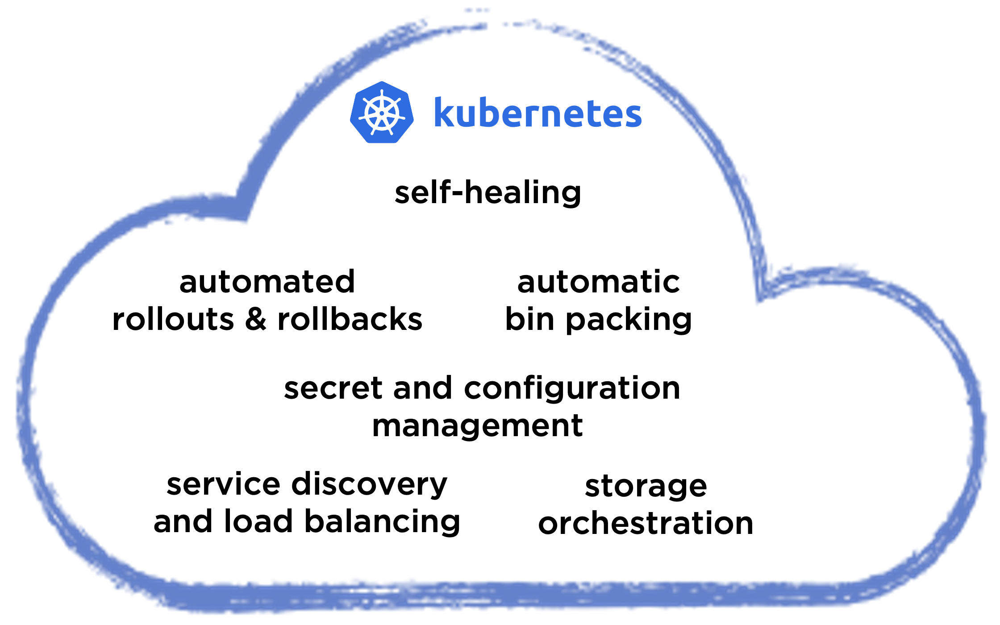

### **Features**

### **Kubernetes Feature Details**
#### **self-healing**
Kubernetes restarts containers that fail, replaces containers, kills containers that don't respond to your user-defined health check, and doesn't advertise them to clients until they are ready to serve.

#### **automatic bin packing**
You provide Kubernetes with a cluster of nodes that it can use to run containerized tasks. You tell Kubernetes how much CPU and RAM each container needs. Kubernetes can fit containers onto your nodes to make the best use of your resources.

#### **automated rollouts and rollbacks**
You can describe the desired state for your deployed containers using Kubernetes. Furthermore, it can change the actual state to the desired state at a controlled rate; e.g., you can automate Kubernetes to create new containers, remove existing containers and adopt all their resources to the new container.

#### **secret and configuration management**
Kubernetes lets you store and manage sensitive information, such as passwords, OAuth tokens, and SSH keys. You can deploy and update secrets and application configuration without rebuilding your container images without exposing secrets in your setup.

#### **service discovery and load balancing**
Kubernetes can expose a container using the DNS name or using their IP address. If traffic to a container is high, Kubernetes can load balance and distribute the network traffic to stabilize the deployment.

#### **storage orchestration**
Kubernetes allows you to automatically mount a storage system of your choice, such as local storage, public cloud providers, and more.